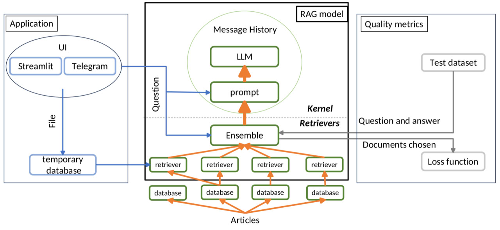

# RAG

## Введение
Этот проект представляет собой реализацию метода **Retrieval Augmented Generation** (RAG), который использует большие языковые модели совместно с моделями, основанными на поиске в сторонних данных, связанных с запросом. Этот подход позволяет увеличить точность ответов в заданной тематике, обеспечить актуальность и уменьшить галлюцинации генеративной модели.

## Архитектура проекта

- RAG model: главная составляющая проекта, производит выделение контекста, связь с LLM и генерацию ответов для пользователей.
- Application: связь с внешними приложениями и UI.
- Quality metrics: тестирование поиска контекста в RAG model

### Kernel
Модуль с подключением к LLM, промптом и историей сообщений. В проекте используется LLM GigaChat.
**modules/Kernel.py**

### Retrievers
Ансамбль ретриверов, который используется для поиска информации в базе данных. Использую ретриверы двух типов: BM25 и на основе векторной базы данных Chroma.
**modules/Retrievers**

#### Ретриверы
* **HF – ретривер на основе векторной базы данных**
* **Bm25 – ретривер bm25**
* **Ensemble – ансамбль ретриверов**

### Quality metrics
Для оценки качества ретривера используется **MAP (Mean Average Precision)**. Это мера точности, учитывающая положение документа после ранжирования. Для расчета MAP требуется разметка.
Без разметки мы можем оценить пересечение между документами, выбранными моделью, и документами из тестового датасета. (см. код)
**modules/Evaluation**

### Бот телеграм
Для демонстрации работы проекта испольщуем чат-бот в Телеграме, который будет отвечать на вопросы пользователей. Бот умеет отвечать на сообщения, используя свою базу знаний, а также искать ответы в приложенном пользователем файле.
**modules/Tg_bot**

## Запуск приложения

Для запуска приложения необходимо прописать необходимые параметры в соответствующем конфигурационном файле: 
- **config.json** для запуска основного пайплайна без привязки к приложению
- **config_tg.json** для запуска бота в телеграмм
- **config_eval.json** для запуска расчета метрики качества